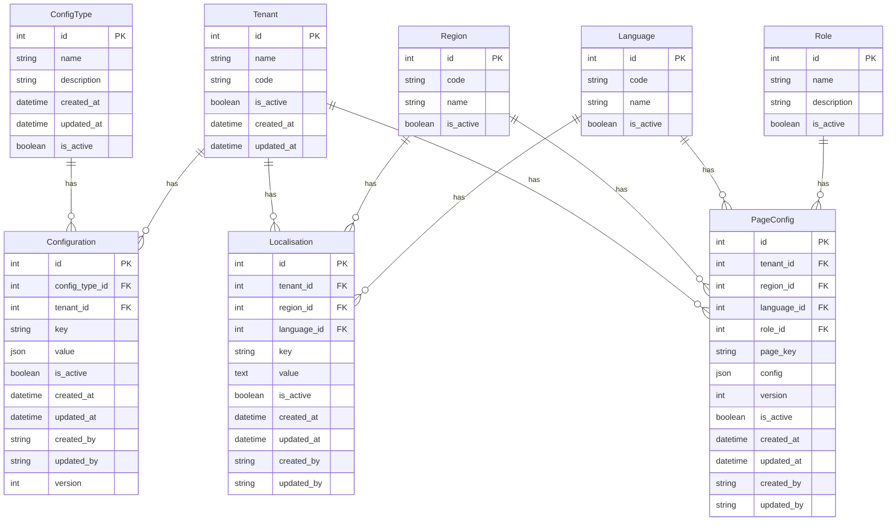

```mermaid
erDiagram
    ConfigType {
        int id PK
        string name
        string description
        datetime created_at
        datetime updated_at
        boolean is_active
    }

    Tenant {
        int id PK
        string name
        string code
        boolean is_active
        datetime created_at
        datetime updated_at
    }

    Region {
        int id PK
        string code
        string name
        boolean is_active
    }

    Language {
        int id PK
        string code
        string name
        boolean is_active
    }

    Role {
        int id PK
        string name
        string description
        boolean is_active
    }

    Configuration {
        int id PK
        int config_type_id FK
        int tenant_id FK
        string key
        json value
        boolean is_active
        datetime created_at
        datetime updated_at
        string created_by
        string updated_by
        int version
    }

    Localisation {
        int id PK
        int tenant_id FK
        int region_id FK
        int language_id FK
        string key
        text value
        boolean is_active
        datetime created_at
        datetime updated_at
        string created_by
        string updated_by
    }

    PageConfig {
        int id PK
        int tenant_id FK
        int region_id FK
        int language_id FK
        int role_id FK
        string page_key
        json config
        int version
        boolean is_active
        datetime created_at
        datetime updated_at
        string created_by
        string updated_by
    }

    ConfigType ||--o{ Configuration : "has"
    Tenant ||--o{ Configuration : "has"
    Tenant ||--o{ Localisation : "has"
    Tenant ||--o{ PageConfig : "has"
    Region ||--o{ Localisation : "has"
    Region ||--o{ PageConfig : "has"
    Language ||--o{ Localisation : "has"
    Language ||--o{ PageConfig : "has"
    Role ||--o{ PageConfig : "has"
   
```
