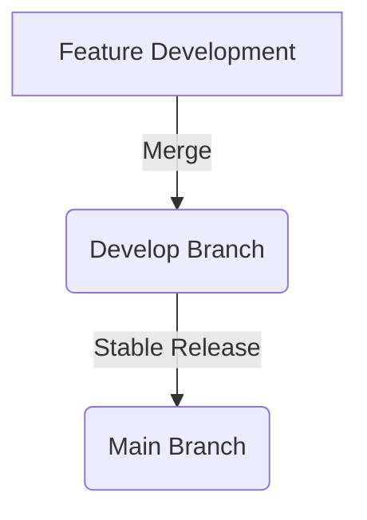
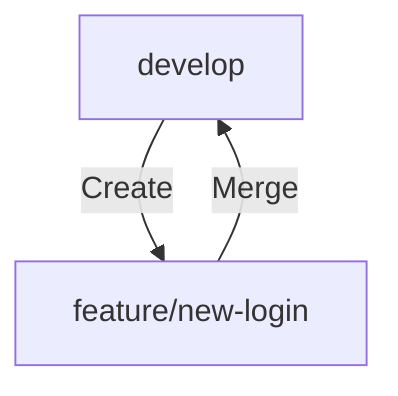
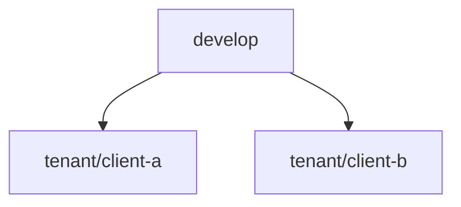
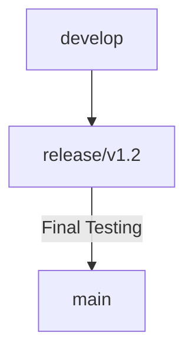
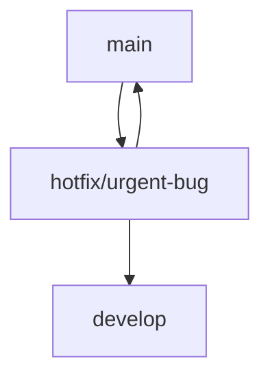

## Overview

This Git branching strategy supports:

- **New feature development** without disturbing existing features.
- **Multi-tenancy variations**, allowing custom versions for different clients.
- **Staged releases** for gradual rollout and testing.

---

## Main Branches

### `main` (Production)

- Contains the **live stable version** of the website.
- Only well-tested and approved changes are merged here.
- Tagged releases (`v1.0`, `v1.1`, etc.) are created from this branch.

### `develop` (Integration)

- Used for **integrating new features** before release.
- All `feature/*` branches merge here first.



---

## Feature Development

### `feature/*` Branches

- Created for new features without affecting existing functionality.
    
- Developers branch from `develop`:
    
    ```sh
    git checkout -b feature/new-login develop
    ```
    
- Merged into `develop` after completion and testing.
    



---

## Multi-Tenant Support

### `tenant/*` Branches

- Created for different **clients or tenants**.
- Based on `develop` to maintain shared features while allowing customizations.

```sh
git checkout -b tenant/client-a develop
```



---

## Staged Releases

### `release/*` Branches

- Created for preparing production releases (`release/v1.2`).
- Used for **QA, bug fixes, and UAT testing** before deployment.

```sh
git checkout -b release/v1.2 develop
```



---

## Hotfixes

### `hotfix/*` Branches

- Created from `main` for **critical bug fixes**.
- Merged into both `main` and `develop` to keep future releases updated.

```sh
git checkout -b hotfix/urgent-bug main
```



---

## Workflow Example

1. **Create a feature branch**
    
    ```sh
    git checkout -b feature/new-dashboard develop
    ```
    
2. **Merge into `develop` after testing**
    
    ```sh
    git checkout develop
    git merge feature/new-dashboard
    ```
    
3. **Sync tenant branch with `develop`**
    
    ```sh
    git checkout tenant/client-a
    git merge develop
    ```
    
4. **Create a release branch for staging**
    
    ```sh
    git checkout -b release/v1.2 develop
    ```
    
5. **After testing, merge into `main` and tag**
    
    ```sh
    git checkout main
    git merge release/v1.2
    git tag v1.2
    git push origin main --tags
    ```
    

---

## Why Use This Strategy?

✅ **Feature Isolation** – Prevents new features from breaking existing ones. ✅ **Multi-Tenancy Support** – Allows client-specific customizations. ✅ **Safe Releases** – Staged rollout ensures stability. ✅ **Emergency Fixes** – Hotfix branches provide quick bug resolution.

Would you like additional customization or improvements? 🚀